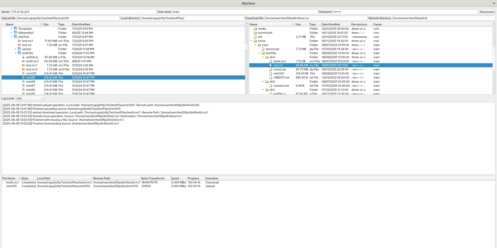

# SFTP Client
SFTP Client is multi-threaded C++ Qt application for managing files over SFTP, designed for Linux systems. The application is still in active development with plans to add more features in the future.



# Features
- Download files from SFTP server 
- Upload files to SFTP server 
- Move files between directories on the server 
- Copy files on the server 
- Delete files from the server 
- Drag & Drop support 
- View local and remote directories in split view 
- Directory search on the server 
- Logger with multiple log levels 
- Rename local file 
- Delete local file 

# Requirements
- **QT 5.15.2** 
- **libcurl** 
- **CMake 3.19+** 

# Build on Linux
```bash
git clone <repo_url>
cd sftp-client
export QTDIR=/path/to/Qt/5.15.2/gcc_64
mkdir build && cd build
cmake .. -DCMAKE_BUILD_TYPE=Release -DCMAKE_PREFIX_PATH=$QTDIR
cmake --build .
```

```
Run:
./SftpClient
```

# Build With Visual Studio (cross-platform)
1. Clone the repository:
```bash
git clone <repo_url>
```
2. Open the project folder in Visual Studio
3. Connect to the remote server with `cross-platform` option.
4.  In `CMakePresets.json`, update the hard coded variables so they point to the correct path:
	- `QT_DIR5`
	- `QT_QPA_PLATFORM_PLUGIN_PATH`
5.  Visual Studio will automatically run `CMake` and configure the project. If not, go to `Project -> Configure SftpClient`.
6.  Click `Build -> Build All` to compile.

